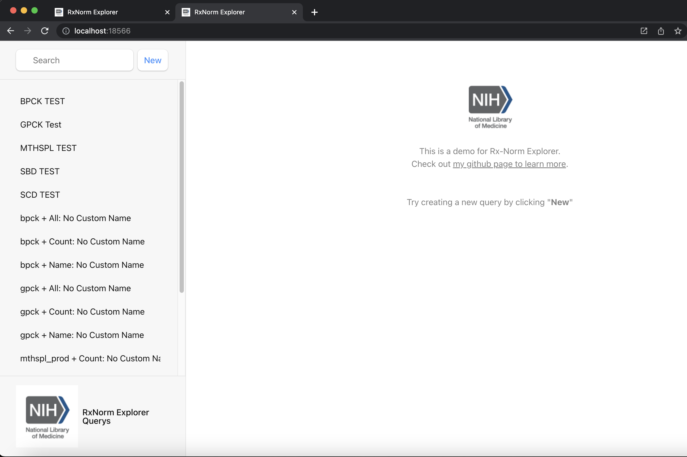
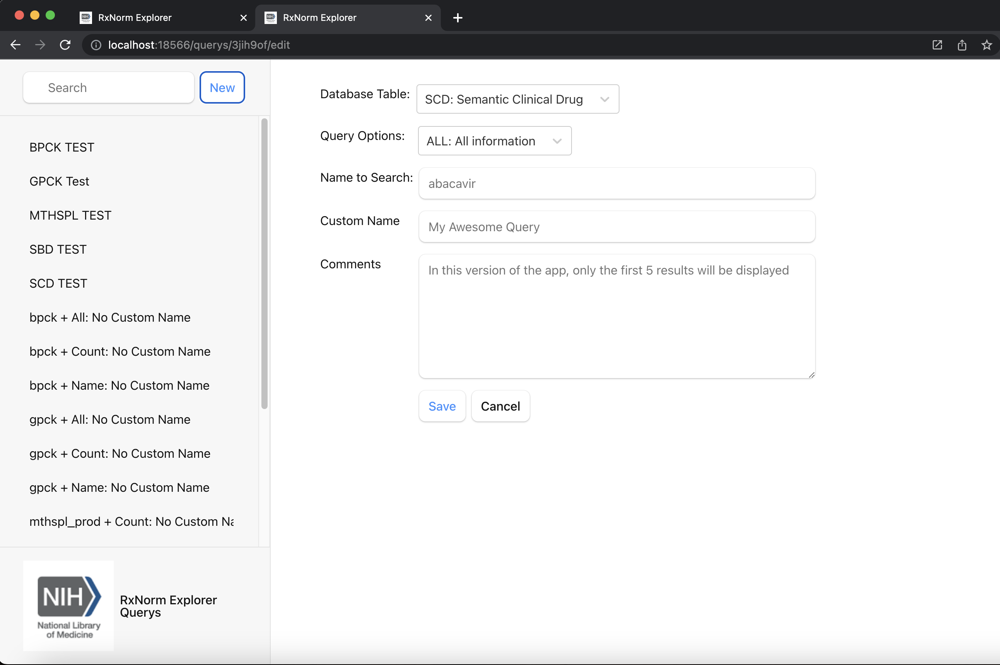
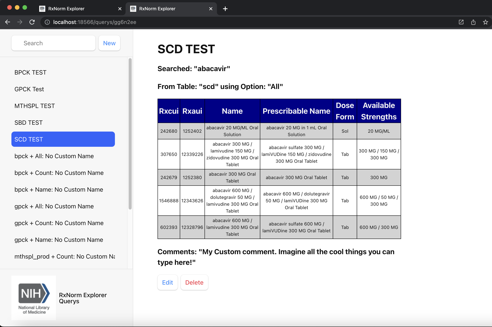

# RxNorm-Explorer

## Overview

This app will allow users to enter various drug identifiers to receive a comprehensive collection of information pertaining to selected drug from the identity used. The user will be able to enter either a drug name, product name, various computer-readable drug identifiers, or other fields to recieve more information on their item.
The RxNorm-Explorer will allow users to gain large amounts of information from just one identifier.

## Data Model

The application will store queried drugs and query results for each user

* data to be queried stored in PostgreSQL (accessed by pg-pool and pg modules)
* comments and custom options stored and duplicatable (results stored in PostgreSQL)
* each query can contain multiple different pieces of information

Example Use 1:

Example Use 2:

## [Link to PostgreSQL Schema](db/sql/create-derived-tables.sql)

See [populate-derived-tables.sql](db/sql/populate-derived-tables.sql) for data in the PostgreSQL Schema

## Example Pages

/ - home page

/create - page for creating and editing a query

/query:id - page for showing result of a query

## Site map

## [Link to Initial Main Project Server File](server/app.mjs)

## [Link to Initial Main Project Client File](client/src/main.jsx)
