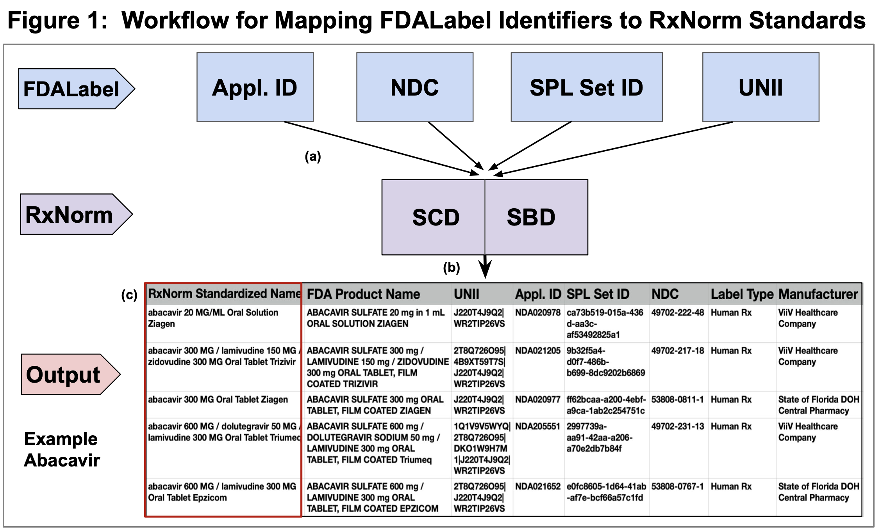
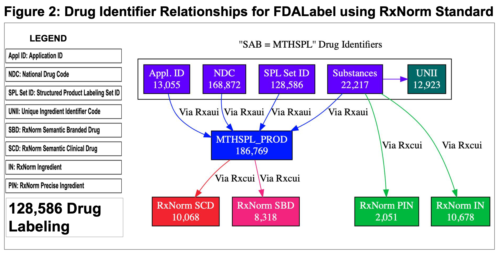
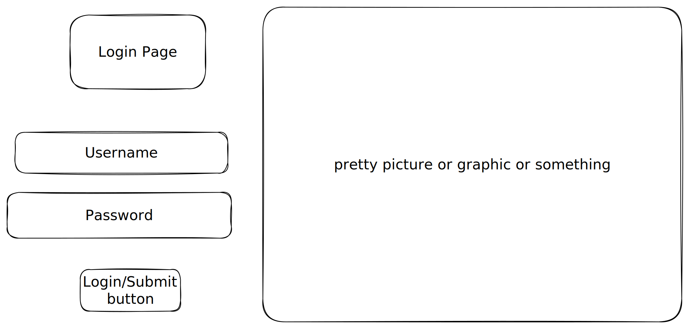
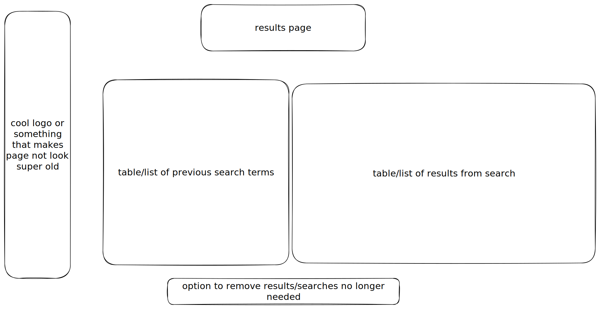

# RxNorm-Explorer

## Overview

This app will allow users to enter various drug identifiers to receive a comprehensive collection of information pertaining to selected drug from the identity used. The user will be able to enter either a drug name, product name, various computer-readable drug identifiers, or other fields to recieve more information on their item.
The RxNorm-Explorer will allow users to gain large amounts of information from just one identifier.

## Data Model

The application will store queried drugs and query results for each user

* data to be queried stored in PostgreSQL (accessed by pg-pool and pg modules)
* users can have multiple queries (results stored in PostgreSQL)
* each query can contain multiple different pieces of information (by json_aggregation)

Example Use 1:

Example Use 2:

## [Link to Commented First Draft Schema](db/sql/create-derived-tables.sql)

See [create-derived-tables.sql](db/sql/create-derived-tables.sql) for PostgreSQL schema

## Wireframes

/search - page for querying different identifiers

/login - page for authenticating user

/result - page for showing results of a user

## Site map

## User Stories

1. as non-registered user, I can register a new account with the site
2. as a user, I can log in to the site
3. as a user, I can search various drug identifiers
4. as a user, I can view all of the queries and results on a single page
5. as a user, I can add more queries to my results page by searching more
6. as a user, I can remove queries from my results that are no longer useful

## Research Topics

* (3 points) currently using dotenv for express-session and pg-pool configuration.

* (6 points) front-end will be a React app (WIP)

* (3 points) plan to add unit tests with Jest to test querys etc... (WIP)

bcrypt or passport for auth?

12 points total out of 10 required points

## [Link to Initial Main Project File](server/app.mjs)

## Annotations / References Used

1. [pg-pool npm page](https://www.npmjs.com/package/pg-pool) - [pg-pool-exec.mjs](server/pg-pool-exec.mjs)
2. [dotenv npm page](https://www.npmjs.com/package/dotenv) - [envs folder](/envs/)
3. [tutorial on flexbox](https://www.joshwcomeau.com/css/interactive-guide-to-flexbox/) - [css WIP](public/css/style.css)
4. [React tutorial](https://react.dev/learn/thinking-in-react) - [client WIP](/client/)
5. Conversations with my father, helped paint a picture of interactions between database (PostgreSQL), middle-tier/server (express app), and front-end/client (react app). Not really sure how to cite this.
